# Codist
*Codist* is a Visual Studio extension which strives to provide better coding experience and productivity for C# programmers.

# Features

* [Advanced syntax highlight](#advanced-c-syntax-highlight) with [*comment tagger*](#comment-tagger-and-styles)
* [Super Quick Info](#super-quick-info) with *Click and Go* to source code
* [Smart Bar](#smart-bar) with symbol reference analyzers
* [Scrollbar Marker](#scrollbar-marker)
* [Symbol Marker](#symbol-marker)
* [Navigation bar](#navigation-bar) (**new in version 4.0**)
* [Display enhancements](#display-enhancements)
* [Comprehensive configurations](#feature-control)
* [License](#License), [Bugs and sugguestions](#bugs-and-suggestions)

## Advanced C# Syntax Highlight

  The advanced syntax highlight function highlights every aspect of C# language elements with various styles and font settings, changing font style sizes, changing background and foreground colors, making text semitransparent.

  The following screenshots of the `TestPage.cs` file in the source code project demonstrates possible syntax highlight effects.

  * The font size of type and member declarations can be enlarged, so it is much easier to spot them.
  * Syntax highlight can be applied to braces and parentheses.
  * Various syntax identifiers have different styles.
  * Comment content can be tagged (e.g. _note_).
  * Unnecessary code is marked strike-through.
  * Keywords are categorized and highlighted with various styles (e.g. `abstract` and `sealed`, `return` and `throw`, etc.).
  * Overriding methods (such as `ToString`) can be painted with gradient background color.
  * Imported symbols (from external assemblies, e.g. `NotImplementedException`, `ToString`) can be marked with a different style (bold here) from symbols in your code, which are also possible to be styled.
  * All the above styles are customizable.
 
  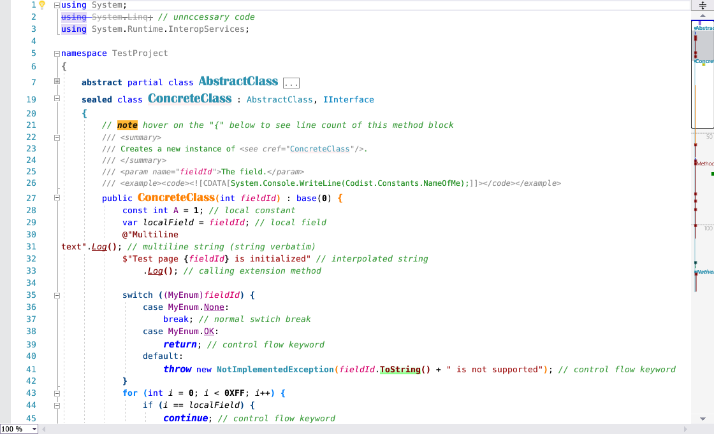 

### Default Syntax Highlight Themes

  To quickly get started with advanced syntax highlight, navigate to the *Syntax Highlight* section, click the *Light theme* or *Dark theme* button in the *options* dialog and see them in effect. Don't forget to click the *OK* button to confirm the change.

  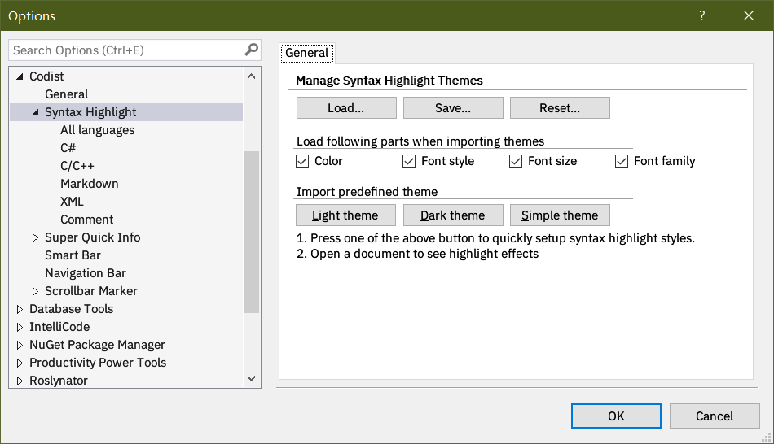

  From version 4.0 on, it is possible to Save and Load your own syntax highlight to an individual file and share it with your workmates.

  **Note**: There is a known issue in _Codist_ that if you change the theme of Visual Studio, you may have to restart it for the syntax highlight to work properly.

### Customization of Syntax Highlight Styles

  To customize and tweak the syntax highlight styles, click the *common syntax* tab in the *syntax highlight* section, or click the sub sections inside the *Syntax Highlight* section to change individual styles, accordingly.

  

  Syntax definitions under the _All languages_ section apply to all languages; those under _Comment_ section apply to comment taggers (see below), others apply to corresponding languages accordingly.

  **TIP**: Open a document window before you change the syntax theme or tweak the syntax highlight settings. While you change theme, you can see how the styles change in the code document window simultaneously.

### My Symbols and External Symbols

  From version 4.0 on, it is possible to identify symbols which are defined in your source code and which are imported from external assemblies.

  You can customize them in the *Symbol Marker* tab of in the *C#* section of *Syntax Highlight*. Style _My Type and Member_ is used for symbols from your code, and _Referenced Type and Member_ is used for symbols imported from external assemblies.

  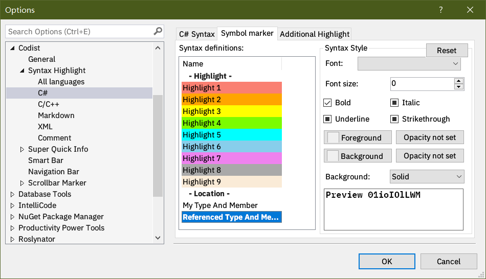

## Comment Tagger and Styles
* The comment tagger highlights comments to your specific styles, according to the first token inside the comment.

  Here's the effect of the highlighted comments.

  

  To configure the comment tags, click the *Tags* tab, in the *Comment* sub-section of the *Syntax Highlight* section, where you can add, remove or modify comment tags. 

  

  To disable comment tagger, uncheck the check box of _Comment Tagger_ on the _Syntax Highlight_ option page.

* The syntax style of comments or C# XML Documentations could be changed too. You can make them semitrasparent to stand behind usual code lines by changing the *Opacity* or the *Font size* value of the corresponding syntax parts.

  

## Super Quick Info

The quick info (the tooltip shown when you hover your mouse pointer on your C# source code) can be enhanced by *Codist*.

### Enhanced Quick Info

  The default quick info built in Visual Studio can be enhanced with:
  1. Size restriction
  2. Click and go to symbols
  3. XML Documentation override, with XML Doc inheritance, `<return>` and `<remarks>` displayed
  4. More info like selection length, color preview, etc.
  5. Hide Quick Info until Shift is pressed

* **Size restriction** 

    Sometimes the Quick Info can take up a lot of space, covering almost half of the screen. It is possible to limit its size with *Super Quick Info*.

  

* **Click and go** to symbols

	If a symbol is defined in your source code, you can click and go to its definition. _Codist_ also tells you where the symbol is defined if you hover your mouse over it.

  

* **XML Documentation override**

    By default, the XML documentation in Quick Info displays type names and sometimes even namespaces of numbers, which can be distractive.

    The overridden documentation shows only member names, but with syntax color, as well as extra `<b>`, `<i>`, `<u>` styles, so you can easier read through the text.

    *Click and Go* also works when *override default XML Doc description* is activated.

    When you really care for the namespace and containing type of the member, hover your mouse on the token in the enhanced Quick Info, an extra tooltip will show up and tell you more.

  

    The overridden Quick Info also provides the ability to inherite XML Doc descriptions from base `class`es or `interface`s.

  

    From version 4.2 on, it is possible to reuse documentations from specific members with the `<inheritdoc cref="MemberName"/>` syntax.

   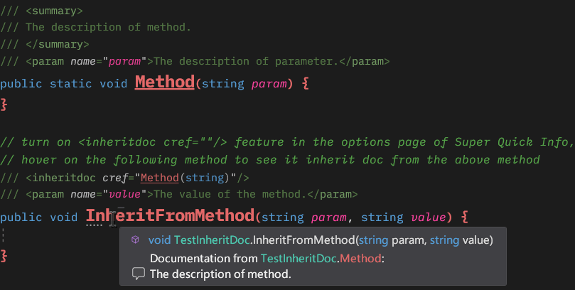

    It is possible to show documentation about the `<returns>` and `<remarks>` content.

  

### Additional Quick Info Items

   A dozen of additional quick info items could be displayed.

* **Attributes**

  

* **Base types and interfaces** of types

  

* **Interface implementation** of member

  

* **Numeric forms** for `Enum` values. The underlying type of `Enum` values can be shown as well.

  

* **Numeric forms** for constants.

  

* **String length and Hash codes** for string constants.
  (Hint: We can use Hash codes to quickly compare whether two strings that look alike are identical)

  

* **Parameter info** shows whether a token or an expression is the parameter of a method in the argument list. What is more, the documentation of the parameter is also displayed.

  

* **Method overloads** shows possible overloads of a method (including applicable extension methods).

  

* **Color info** shows colors as you hover on a name that might be predefined color values.

  

### Customization

To customize the *Super Quick Info*, adjust the settings in the options page.

  

## Smart Bar

The *Smart Bar* is a context-aware tool bar that appears automatically when you select some text, or double tap the _Shift_ key on your keyboard.

It brings commonly used operations for the selection, such as editing operations like _Cut_, _Copy_, _Paste_,  _Delete_, _Duplicate_, _Find_, code analysis operations like _Go to defintion_, _Find references_, refactoring operations like _Rename_, _Extract method_, etc.

  

Buttons on the *Smart Bar* changes according to your selection.

  

From version 3.7 on, when you select a symbol and click the *Analyze symbol...* button, a menu will pop up showing possible symbol analysis commands.

  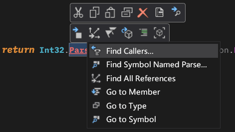

From version 3.9 on, you can change the behavior of the Smart Bar.

  

From version 4.4 on, _Smart Bar_ also works on _Output_, _C# Interactive_, _Immediate (Debug)_, _Find Results_ and some other text selectable window panes. If you select a path within those windows, extra command will pop up allowing you to open it directly or locate it in _Windows Explorer_.

  

From version 4.4 on, some extra buttons will show up on _Smart Bar_ in C/C++ code windows.

## Scrollbar Marker

Scollbar Marker draws extra glyphs and shapes on the scrollbar for the following syntax elements:

* C# `class`/`struct`/`interface`/`enum` **declarations** (marked with a square and their names)
* C# symbol match marker (matches symbol under the caret, marked with an aqua square)
* C# instructions (`#if`, `#else`, `#region`, `#pragma`) (marked with a gray spot)
* **Line numbers** (marked with gray dashed lines and numbers)
* Special comments tagged by comment tagger (marked with small squares)

  Please see screenshots in the above sections.

## Symbol Marker

  Symbol marker is a new feature introduced in version 3.8.

  Typically, you can double click a symbol in the C# source code, select the *Mark Symbol* command on the *Smart Bar* and choose the desired highlight marker on the drop-down menu.

  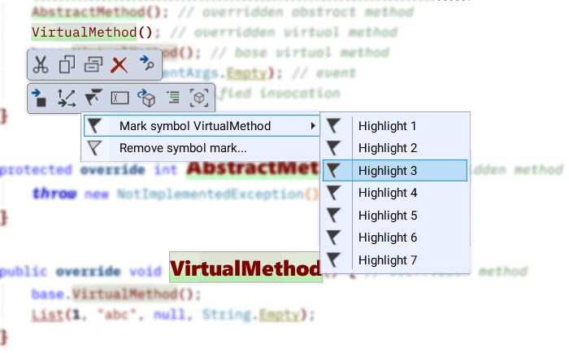

  After applying the command, all occurrences of the marked symbol will be marked with a different style.

  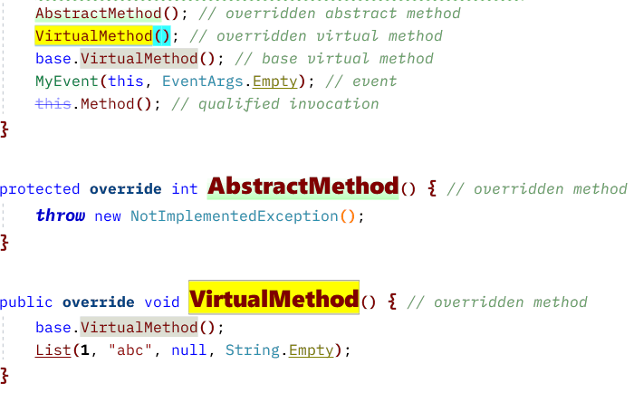

  To remove symbol marker, click the *Remove symbol mark* command in the drop-down menu of the *Mark symbol* command.

  Symbol markers will be cleared when the solution is unloaded.

  The style of symbol markers can be customized in options page of the *Syntax highlight* feature. The default colors are listed below.

  

## Navigation Bar

  Navigation bar is a new feature introduced since version 4.0. It overrides the original navigation bar on the top of the document window.

  It not only shows available types and declarations in the code window like the original navigation bar, but also syntax nodes containing the caret.

  When you hover the mouse over the node on the bar, corresponding span of the node will be highlighted in the editor.

  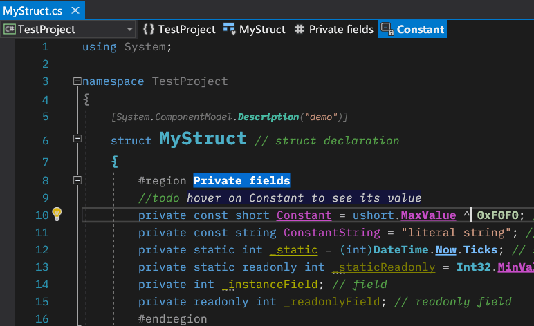

  Clicking on the syntax node on the navigation bar will select the corresponding span in the editor. If you have enabled _Smart Bar_ as well, _Smart bar_ will appear offering operations that can be performed against the syntax node.

  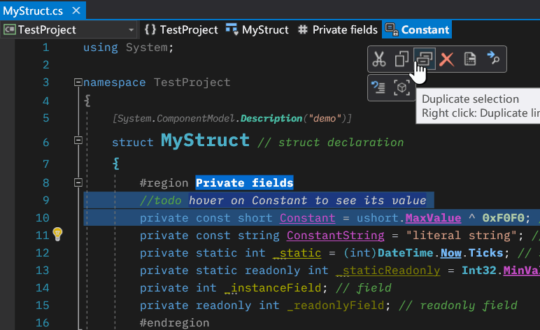

  Clicking on namespace or class definition syntax node will drop down a menu, showing members defined under it.

  You can type in the text box nearby the funnel icon to filter members listed in the menu. The buttons to the right hand side of the text box can be used to further filter the results.

  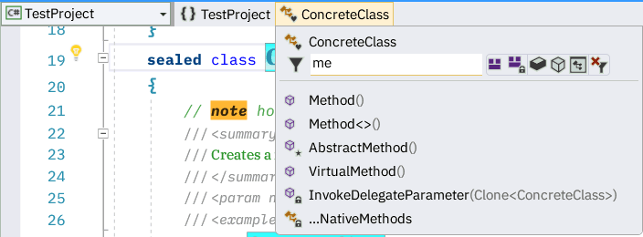

  More than showing the name of type and members, the drop-down menu also shows member initial values for fields, and initial values and lambda expressions for properties.

  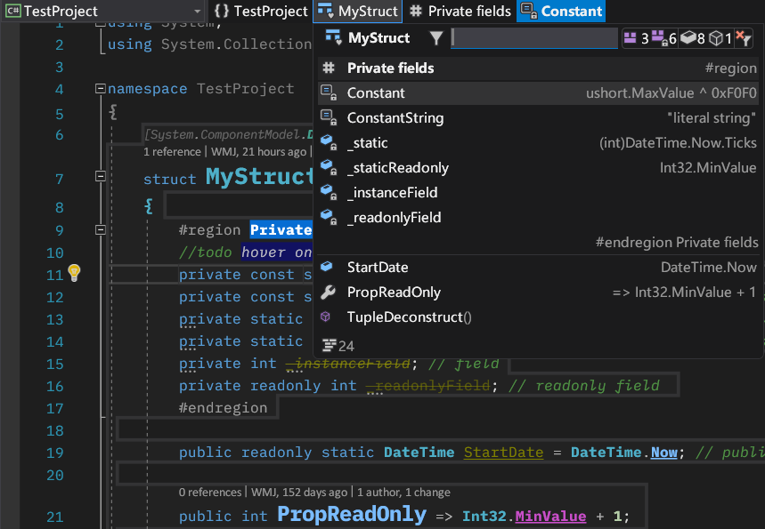

  Clicking on the namespace button at the left side of the navigation bar will pop up a text box and list all namespaces and types available in active document.

  You can type some text in it and search for declarations defined in the active document.

  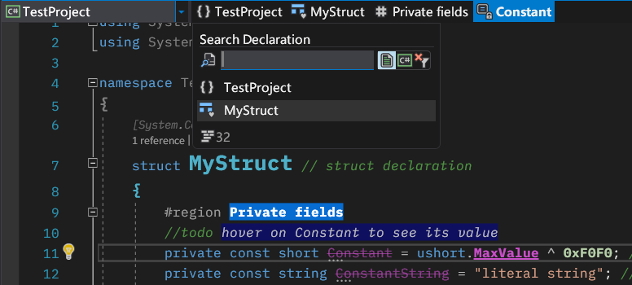

  It is possible to expand the search scope to project-wide, by clicking the second button nearby the text box.

  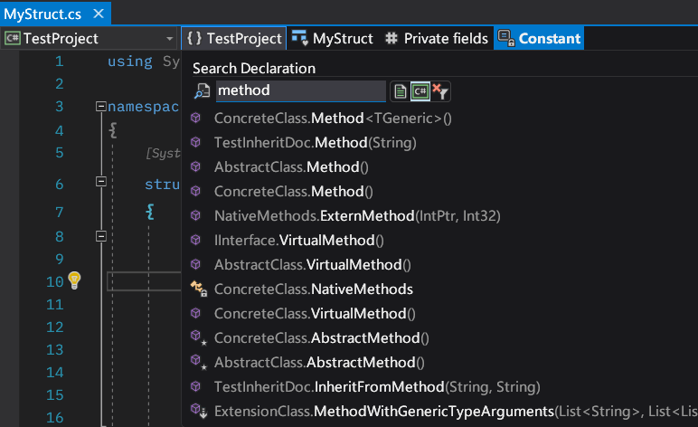

## Display Enhancements

In the *Display* tab of the *General* options page, several display enhancement options are offered.

  

Within the *Extra line margins* group box, you can adjust margins between lines to make code lines more readable.

Programmers who do not like *ClearType* rendering, which made text blurry and colorful, may want to try _Force Grayscale Text Rendering_ options.

# Feature Control
  Open the *Codist* section in the *Tools->Options* dialog. In the *General* section you can toggle features of *Codist*.

  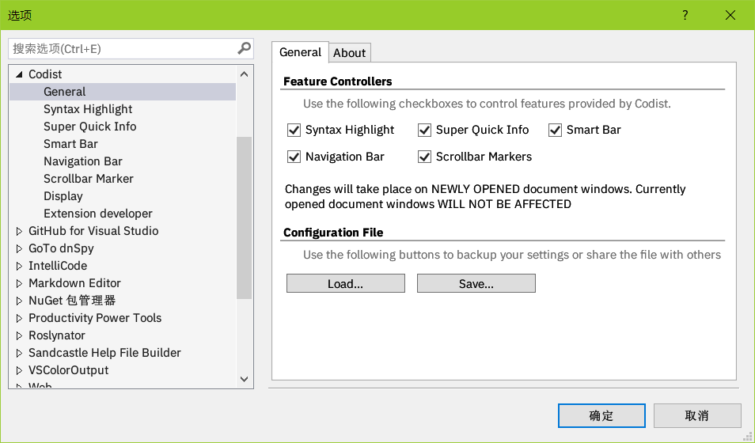

1. *Feature controllers* contains check boxes which can be used to enable/disable features of *Codist*.

   When you are running on a laptop with battery. Disabling *Codist* may help it sustain a little bit longer.

   Someone who does not like the syntax highlight or use another syntax highlighter can also turn off the *Syntax Highlight* feature individually here.

   These **options will take effect on new document windows**. Existing document windows won't be affected.

2. To share or backup your settings of Codist, you can use the *Save* and *Load* buttons.

# Acknowledgements
I have learned a lot from the following extension projects.
* Visual Studio Productivity Power Tools: https://github.com/Microsoft/VS-PPT
* CoCo: https://github.com/GeorgeAlexandria/CoCo
* Better comments: https://github.com/omsharp/BetterComments
* CommentsPlus: https://github.com/mhoumann/CommentsPlus
* Inheritance Margin: https://github.com/tunnelvisionlabs/InheritanceMargin
* Font Sizer: https://github.com/Oceanware/FontSizer
* CodeBlockEndTag: https://github.com/KhaosCoders/VSCodeBlockEndTag
* Remarker: https://github.com/jgyo/remarker
* UntabifyReplacement: https://github.com/cpmcgrath/UntabifyReplacement
* Extensiblity Tools: https://github.com/madskristensen/ExtensibilityTools
* CodeMaid: https://github.com/codecadwallader/codemaid

# License

_Codist_ comes from the open source community and it goes back to the community.

_Codist_ is **free** software: you can redistribute it and/or modify it under the terms of the GNU General Public License as published by the Free Software Foundation, either version 3 of the License, or (at your option) any later version.

This program is distributed in the hope that it will be useful, but WITHOUT ANY WARRANTY; without even the implied warranty of MERCHANTABILITY or FITNESS FOR A PARTICULAR PURPOSE. See the GNU General Public License for more details.

You should have received a copy of the GNU General Public License along with this program. If not, see "https://www.gnu.org/licenses".

# Bugs and Suggestions
Please [post New Issue](https://github.com/wmjordan/Codist/issues) in the [GitHub project](https://github.com/wmjordan/Codist) if you find any bug or have any suggestion.

Your vote and feedback on the [Visual Studio Extension Marketplace](https://marketplace.visualstudio.com/items?itemName=wmj.Codist) are also welcomed.

# Support Codist by Donation

If you like _Codist_ and want to support the future development of it, you can [donate to the author](https://paypal.me/wmzuo/19.99).

You can donate any amount of money as you like. The recommended amount of donation is `$19.99`.
