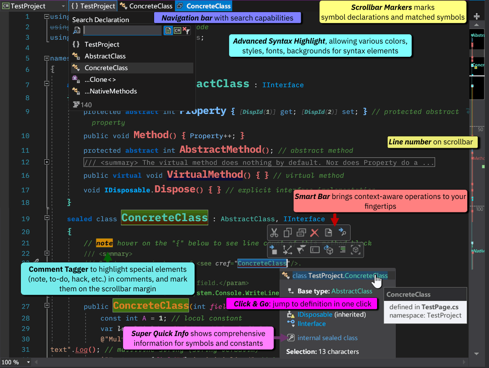
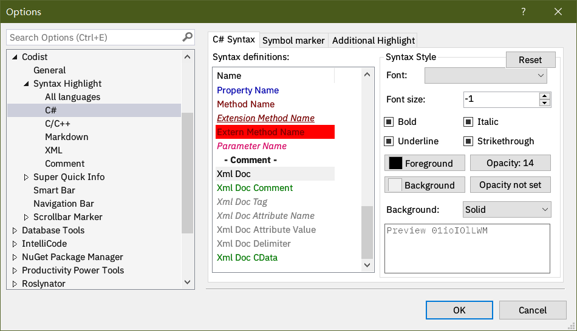

# Codist
*Codist* is a visual studio extension which strives to provide better coding experience for C# programmers. It features:

* Advanced syntax highlight with *comment tagger*
* Super Quick Info with *Click and Go* to source code
* Smart Bar (**new in version 3.0**)
* Scrollbar markers
* Extra margin between lines

# Features and screenshots

## Advanced C# syntax highlight

  The advanced syntax highlight function highlights every aspect of C# language elements with various styles and font settings, changing font style sizes, changing background and foreground colors, making text semitransparent.

  The following screenshots of the `TestPage.cs` file in the source code project demonstrates possible syntax highlight effects.

  * The font size of type and member declarations can be enlarged, so it is much easier to spot them.
  * Interface, Class, Struct and Enum names have different colors.
  * Some elements, such as `Enum` names, `virtual` or `override` members, can be painted with specific style, indicating that they are special.
  * The attribute declarations can be dimmed.
  * Static fields have underlines.
  * Unnecessary code is marked strike-through.
  * Control flow related keywords (`return`, `throw`, `break`, `continue`, `yield` and `goto`) are highlighted with a different style.
  * Abstraction related keywords (`sealed`, `override`, `virtual`, etc) can be highlighted with an other style.
  * All the above styles are customizable.
 
  
  
  

  **NOTE**: To quickly get started with advanced syntax highlight, navigate to the *Syntax Highlight* section, click the *Light theme* or *Dark theme* button in the *options* dialog and see them in effect. Don't forget to click the *OK* button to confirm the change.

  

  To customize and tweak the syntax highlight effects, click the *common syntax* tab in the *syntax highlight* section, or click the sub sections inside the *Syntax Highlight* section to change individual styles, accordingly.

  

  **TIP**: Open a document window before you change the syntax theme or tweak the syntax highlight settings, while you change theme, you can see how the styles change in the code document window simultaneously.

## Super Quick Info

The quick info (the tooltip shown when you hover your mouse pointer on your C# source code) can be enhanced by *Codist*.

### Enhanced Quick Info

  The default quick info built in Visual Studio can be enhanced with:
  1. Size restriction
  2. Click and go to symbols
  3. XML Documentation override, with XML Doc inheritance, `<return>` exposure
  4. Hide Quick Info until Shift is pressed

* **Size restriction** 

    Sometimes the size of Quick Info can take up a lot of space. It is possible to limit its size with *Super Quick Info*.

  

* **Click and go** to symbols

	If a symbol is defined in your source code, you can click and go to its definition. It also tells you where the symbol is defined.

  

* **XML Documentation override**

    By default, the XML documentation in Quick Info displays type names and sometimes even namespaces of numbers, which can be distractive.

    The overridden documentation shows only member names, but with syntax color, as well as extra `<b>`, `<i>`, `<u>` styles, so you can easier read through the text.

    *Click and Go* also works when *override default XML Doc description* is activated.

    When you really care for the namespace and containing type of the member, hover your mouse on the token in the enhanced Quick Info, an extra tooltip will show up and tell you more.

  

    The overridden Quick Info also provides the ability to inherite XML Doc descriptions from base types or interfaces.

  

    It is possible to show documentation about the `<return>` values.

  

### Additional Quick Info Items

   A dozen of additional quick info items could be displayed.

* **Attributes**

  

* **Base types and interfaces** of types

  

* **Interface implementation** of member

  

* **Numeric forms** for `Enum` values. The underlying type of `Enum` values can be shown as well.

  

* **Numeric forms** for constants.

  

* **String length and Hash codes** for string constants. (Hint: We can use Hash codes to quickly compare whether two strings that look alike are identical)

  

* **Parameter info** shows whether a token or an expression is the parameter of a method in the argument list. What is more, the documentation of the parameter is also displayed.

  

* **Method overloads** shows possible overloads of a method that you may be interested in.

  

## Comment tagger and styles
* The comment tagger highlights comments to your specific styles, according to the first token inside the comment.

  Here's the effect of the highlighted comments.

  

  To configure the comment tags, click the *Tags* tab, in the *Comment* sub-section of the *Syntax Highlight* section, where you can add, remove or modify comment tags. 

  

* The syntax style of comments or C# XML Documentations could be changed too. You can make them semitrasparent to stand behind usual code lines by changing the *Opacity* or the *Font size* value of the corresponding syntax parts.

  

## Markers on the Scrollbar Margin

The scrollbar can mark...

* C# `class`/`struct`/`interface`/`enum` **declarations** (marked with the first two capitalized characters in their names)
* C# instructions (`#if`, `#else`, `#region`, `#pragma`) (marked with a gray spot)
* **Line numbers** (marked with gray dashed lines and numbers)
* Special comments (marked with small squares)

  Please see screenshots in the above sections.

## Smart Bar

The *Smart Bar* is a context-aware tool bar appeared automatically when you select some text.

It brings commonly used operations for the selection.

  

Buttons on the *Smart Bar* changes from contexts.

  

# Feature control
  Open the *Codist* section in the *Tools->Options* dialog. In the *General* section you can toggle features of *Codist*.

  

1. *Feature controllers* contains check boxes which can be used to enable/disable features of *Codist*.

   It is useful when your laptop are running on battery. Disabling *Codist* may help it sustain a little bit longer.

   Someone who does not like the syntax highlight or use another syntax highlighter can also turn off the *Syntax Highlight* feature individually here.

   These options affects new document windows. Existing document windows won't be affected.

2. Within the *Extra line margins* group box, you can adjust margins between lines to make code lines more readable.

# Acknowledgements
I have learned a lot from the following extension projects.
* Visual Studio Productivity Power Tools: https://github.com/Microsoft/VS-PPT
* CoCo: https://github.com/GeorgeAlexandria/CoCo
* Better comments: https://github.com/omsharp/BetterComments
* CommentsPlus: https://github.com/mhoumann/CommentsPlus
* Inheritance Margin: https://github.com/tunnelvisionlabs/InheritanceMargin
* Font Sizer: https://github.com/Oceanware/FontSizer
* CodeBlockEndTag: https://github.com/KhaosCoders/VSCodeBlockEndTag
* Remarker: https://github.com/jgyo/remarker
* UntabifyReplacement: https://github.com/cpmcgrath/UntabifyReplacement
* Extensiblity Tools: https://github.com/madskristensen/ExtensibilityTools

# Bugs and suggestions
Please [post New Issue](https://github.com/wmjordan/Codist/issues) in the [GitHub project](https://github.com/wmjordan/Codist) if you find any bug or have any suggestion.

Your vote and feedback on the [Visual Studio Extension Marketplace](https://marketplace.visualstudio.com/items?itemName=wmj.Codist) are also welcomed.
