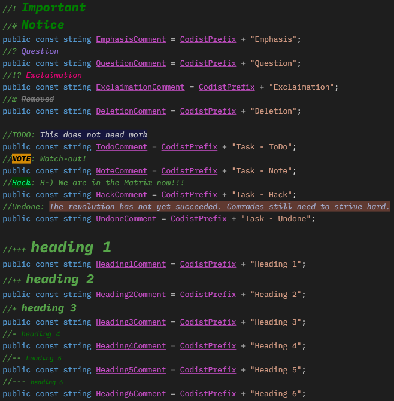

# Codist
*Codist* is a visual studio extension which strives to provide better coding experience for C# programmers. It features:
* advanced syntax highlighting
* super Quick Info
* C# comment tagger
* scrollbar markers
* increased margin between lines

# Features and screenshots

## Advanced C# syntax highlight
* The advanced syntax highlight function highlight every aspect of C# language elements with various styles and font settings, changing font style sizes, changing background and foreground colors, making text semitransparent.

  **NOTE**: To quickly get started with advanced syntax highlight, click the *Load...* button in the *options* dialog, select *Light theme* or *Dark theme* from the pop-up menu to see them in effect. Don't forget to click the *OK* button to confirm the change.

  

  The following screenshots of the `TestPage.cs` file in the source code project demonstrates possible syntax highlight effects.

  * The font size of type and member declarations can be enlarged, so it is much easier to spot them.
  * Interface, Class, Struct and Enum names have different colors.
  * Some elements, such as `Enum` names, `virtual` or `override` members, can be painted with specific background gradient colors, indicating that they are special.
  * The attribute declarations can be dimmed.
  * Static fields have underlines.
  * Unnecessary code is marked strike-through.
  * Control flow related keywords (`return`, `throw`, `break`, `continue`, `yield` and `goto`) are highlighted with a different style.
  * All the above effects are customizable.
 
  
  
  

## Super Quick Info

The quick info (the tooltip shown when you hover your mouse pointer to language elements) can be enhanced by *Codist*.

* **Numeric forms** for `Enum` values. The underlying type of `Enum` values can be shown as well.

  

* **Numeric forms** for constants.

  

* **String length and Hash codes** for string constants. (Hint: We can use Hash codes to quickly compare whether two strings that look alike are identical)

  

* Locations of **Extension methods**

  

* **Attributes**

  

* **Base types and interfaces** of types

  

* **Click and go** of symbols

	If a symbol is defined in your source code, you can click and go to its definition.

## Customized comment styles
* The comment tagger highlights comments to your specific styles.

  

  Here's the effect of the highlighted comments.

  

* The syntax style of comments or C# XML Documentations could be changed too. You can make them semitrasparent to stand behind usual code lines by changing the *Opacity* value of the corresponding syntax parts.

## Markers on the Scrollbar Margin

The scrollbar can mark...

* C# `class`/`struct`/`interface`/`enum` **declarations** (marked with the first two capitalized characters in their names)
* C# instructions (`#if`, `#else`, `#region`, `#pragma`) (marked with a gray spot)
* **Line numbers** (marked with gray dashed lines and numbers)
* Special comments (marked with small squares)

  Please see screenshots in the above sections.

# Customization
  Open the *Codist* section in the *Tools->Options* dialog.

1. In the *General* option page, you can add extra margin between lines to make code text more readable.
2. You can also save your preferred settings or load certain settings that come with *Codist*.

  

1. Go to the *C#* options page to change C# related settings.

  

1. Go to the *Syntax color* options page to change the syntax highlight settings according to your preferences.

  

# Acknowledgements
I have learned a lot from the following extension projects.
* Visual Studio Productivity Power Tools: https://github.com/Microsoft/VS-PPT
* CoCo: https://github.com/GeorgeAlexandria/CoCo
* Better comments: https://github.com/omsharp/BetterComments
* CommentsPlus: https://github.com/mhoumann/CommentsPlus
* Inheritance Margin: https://github.com/tunnelvisionlabs/InheritanceMargin
* Font Sizer: https://github.com/Oceanware/FontSizer
* CodeBlockEndTag: https://github.com/KhaosCoders/VSCodeBlockEndTag
* Remarker: https://github.com/jgyo/remarker

# Bugs and suggestions
Please post New Issue in the GitHub project if you find any bugs or have any suggestions.
